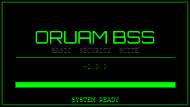
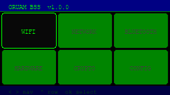

# ORUAM BSS — Basic Security Suite

> A portable security toolkit for the **M5Cardputer ADV**, built on ESP32-S3.  
> Developed by [@juliomauro](https://github.com/juliomauro) · Codename: **KIRK**

---

## Preview

| Boot Splash | Main Menu |
|---|---|
|  |  |

> Screenshots generated from `preview.html` — pixel-accurate render of the 240×135 display.

---

## About

**ORUAM BSS** is a custom firmware for the M5Cardputer ADV that turns the device into a compact, handheld security reconnaissance tool. The project explores what an ESP32-S3-based device can do in the field of network and wireless security — no Linux, no external SBCs, pure embedded C++.

The name carries a double meaning: **ORUAM** is the author's security codename, and **BSS** (*Basic Security Suite*) is also a reference to the 802.11 wireless term *Basic Service Set* — a nod to the WiFi-heavy nature of the tool.

**Stack:** C++ · PlatformIO · Arduino Core · M5Cardputer library · Adafruit NeoPixel

---

## Hardware

| Component | Spec |
|---|---|
| Platform | M5Cardputer ADV |
| SoC | ESP32-S3FN8 (dual-core Xtensa LX7, 240MHz) |
| RAM | 512KB SRAM + 8MB PSRAM |
| Flash | 8MB |
| Display | 1.14" IPS TFT · 240×135 · ST7789 |
| Input | Full QWERTY keyboard + physical arrow keys |
| Wireless | WiFi 802.11 b/g/n (2.4GHz) · Bluetooth 5.0 / BLE |
| RGB LED | WS2812 NeoPixel (GPIO 21) |
| Extra | Microphone · IR transmitter · Module expansion slot |
| Storage | MicroSD card (SPI — CS:12 SCK:40 MISO:39 MOSI:14) |

---

## Navigation

| Key | Symbol | Action |
|---|---|---|
| `,` | ◄ | Navigate left / previous column |
| `/` | ► | Navigate right / next column |
| `;` | ▲ | Navigate up / scroll up in lists |
| `.` | ▼ | Navigate down / scroll down in lists |
| `Enter` | ok | Select / confirm |
| `` ` `` | ESC | Back / cancel / abort (same physical key as `` ` `` and `~` — press without Fn) |
| Side button | — | Next item (fallback) |

---

## Modules

### Implemented

#### CONFIG
- **WiFi Connect** — enter SSID and password via keyboard, connects and shows acquired IP
- **Brightness** — real-time display brightness slider (`,`/`;`/`/`/`.` to adjust)
- **About** — firmware version, codename, author, board, chip, free heap, IP if connected

#### NETWORK *(requires WiFi connection)*
- **Host Discovery** — TCP sweep on the local /24 subnet (ports 80 and 22, 100ms timeout). Shows live results during scan. Press `ESC` to abort, `s` to save results as CSV on SD card.
- **Port Scan** — TCP connect scan on 15 common ports (FTP, SSH, Telnet, SMTP, DNS, HTTP, POP3, IMAP, HTTPS, SMB, MySQL, RDP, VNC, HTTP-Alt, HTTPS-Alt) against a user-supplied IP. Press `ESC` to abort, `s` to save as CSV.
- **DNS Lookup** — resolves a hostname to IP address

### Planned

#### WIFI
- [ ] Network Scanner — SSID, BSSID, channel, RSSI, encryption type
- [ ] Beacon Sniffer — passive 802.11 management frame capture (promiscuous mode)
- [ ] Evil Portal — rogue AP with captive portal

#### BLUETOOTH
- [ ] BLE Scanner — device discovery, RSSI, UUIDs, advertised name
- [ ] GATT Explorer — browse services and characteristics of BLE devices

#### IR *(built-in transmitter)*
- [ ] TV-B-Gone — universal power-off remote
- [ ] IR Capture — record IR signals from remotes
- [ ] IR Replay — transmit captured signals

#### HARDWARE
- [ ] I2C Scanner — detect devices on the I2C bus

#### CRYPTO
- [ ] Hash Calculator — MD5 / SHA1 / SHA256 (hardware accelerated on ESP32-S3)
- [ ] Base64 Encoder / Decoder
- [ ] JWT Decoder — inspect JSON Web Token payloads

---

## LED Feedback

The onboard RGB LED (NeoPixel, GPIO 21) provides status feedback:

| Event | LED behavior |
|---|---|
| WiFi connected | "CONNECTED" in Morse code, green |
| WiFi failed | 3 fast blinks, red |

---

## SD Card Export

Scan results can be saved as CSV directly to the SD card.  
Press `s` on any result screen to export.

Files are saved to `/BSS/` with auto-incremented names:

| Scan type | Filename | Format |
|---|---|---|
| Host Discovery | `hosts_001.csv` | `ip` |
| Port Scan | `ports_001.csv` | `target,port,service` |

---

## Implementation Status

### Core / UI
- [x] PlatformIO project structure
- [x] M5Cardputer library initialization
- [x] Boot splash screen with animated loading bar
- [x] Graphical menu — 3×2 icon grid, neutral dark theme
- [x] Arrow key navigation (`,` `/` `;` `.`) + side button fallback
- [x] Reusable sub-menu component
- [x] Reusable text input component (with password masking)
- [x] RGB LED control (NeoPixel)
- [x] SD card CSV export
- [ ] Status bar (IP, battery, SD)

### Modules
- [x] CONFIG — WiFi Connect, Brightness, About
- [x] NETWORK — Host Discovery, Port Scan, DNS Lookup
- [ ] WIFI — Network Scanner, Beacon Sniffer, Evil Portal
- [ ] BLUETOOTH — BLE Scanner, GATT Explorer
- [ ] IR — TV-B-Gone, Capture, Replay
- [ ] HARDWARE — I2C Scanner
- [ ] CRYPTO — Hash Calculator, Base64, JWT Decoder

---

## Project Structure

```
oruam-BSS/
├── src/
│   └── main.cpp              # Entry point
├── include/
│   ├── config.h              # Constants, colors, pin definitions
│   ├── splash.h              # Boot splash screen
│   ├── menu.h                # Main menu grid + input dispatch
│   ├── input.h               # Reusable sub-menu and text input
│   ├── led.h                 # NeoPixel RGB LED + Morse code
│   ├── sd_utils.h            # SD card init and CSV writer
│   └── modules/
│       ├── config.h          # CONFIG module
│       └── network.h         # NETWORK module
├── assets/
│   ├── preview-splash.png
│   └── preview-menu.png
├── platformio.ini
└── wokwi.toml
```

---

## Development Setup

```bash
git clone https://github.com/juliomauro/oruam-BSS.git
cd oruam-BSS
code .
```

Requires [PlatformIO](https://platformio.org/) installed in VS Code.

```bash
# Build (.bin gerado em .pio/build/m5stack-cardputer/firmware.bin)
pio run

# Upload directly via USB
pio run --target upload

# Monitor serial output
pio device monitor
```

> **Note:** The system-installed PlatformIO (v4.3.4) is incompatible with Python 3.12.  
> Install the updated version: `pip install --upgrade platformio --break-system-packages`  
> Then use `~/.local/bin/pio run`.

> **macOS SD card artifacts:** If building after the library was downloaded on macOS, run  
> `find .pio/libdeps -name "._*" -delete` before building to remove AppleDouble metadata files.

### platformio.ini

```ini
[env:m5stack-cardputer]
platform  = espressif32
board     = m5stack-stamps3
framework = arduino

lib_deps =
    m5stack/M5Cardputer
    adafruit/Adafruit NeoPixel @ ^1.12.3
```

---

## Disclaimer

This tool is intended for **authorized security assessments, educational purposes, and personal research only**. Do not use against networks or devices you do not own or have explicit permission to test. The author takes no responsibility for misuse.

---

## License

Apache License 2.0 — see [LICENSE](LICENSE)

---

*"Not every hack needs a Raspberry Pi."*
